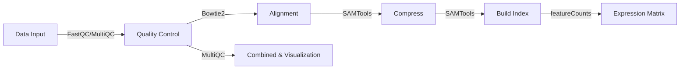
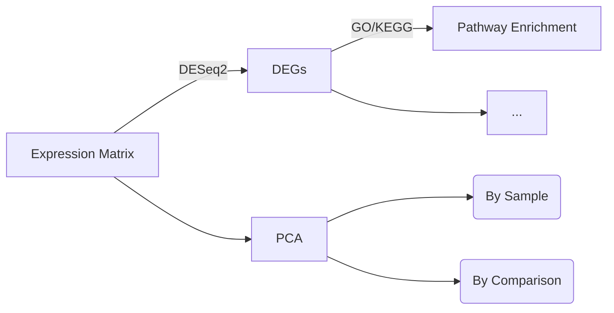

# Singh RNA-Seq Analysis

## Sample Information
The dataset comprises 60 raw FASTQ files from 30 samples. Detailed sample information and the comparisons used for differential expression analysis are provided in the [group.csv](https://github.com/XLions/Singh_RNA-Seq/blob/2833b0df523c1e310639711409b6ebdd3d97ddb8/Downstream/00_PreProcess/group.csv) file.  

## Workflow
*   **1. Upstream: Raw Data (.Fastq.gz) to Expression Matrix (.csv)**

*   **2. Downstream: Based on Expression Matrix (.csv)**

