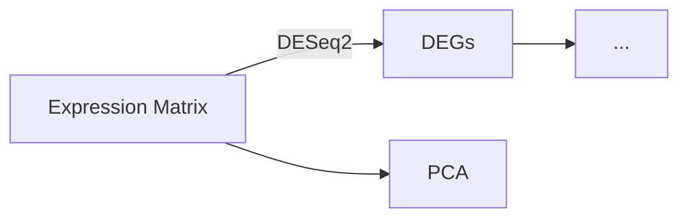

# Singh RNA-Seq Analysis

## Sample Information

## Workflow
*   **1. Upstream: Raw Data (.Fastq.gz) to Expression Matrix (.csv)**

```mermaid
graph LR
    A[Data Input] -- FastQC/MultiQC --> B[Quality Control]
    B -- Bowtie2 --> C[Alignment]
    C -- SAMTools --> D[Compress]
    D -- SAMTools --> E[Build Index]
    E -- featureCounts --> F[Expression Matrix]
    B -- MultiQC --> G[Combined % Visualization]
```

*   **2. Downstream: Based on Expression Matrix (.csv)**

```mermaid
graph LR
    A[Expression Matrix] -- DESeq2 --> B[DEGs]
    A --> C[PCA]
    B --> D[...]
```
